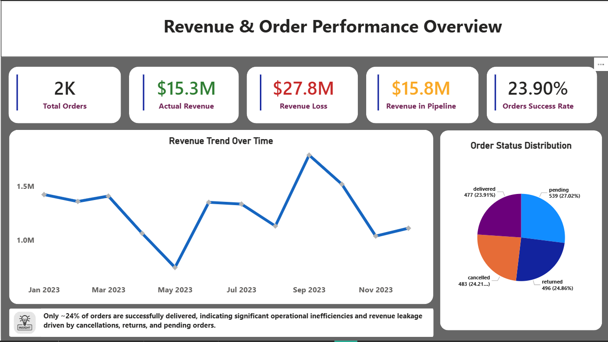
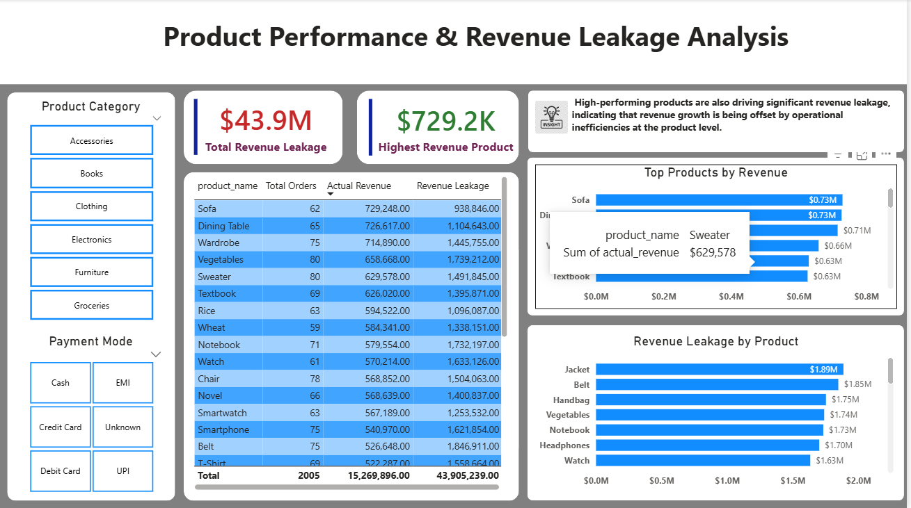
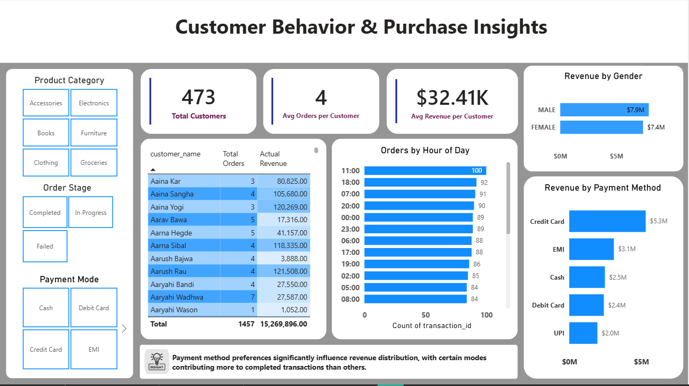

# 📊 E-Commerce Sales & Customer Behavior Analysis

## 🔍 Project Overview

This is an end-to-end data analysis project using SQL and Power BI. The objective is to analyze e-commerce transactional data to uncover insights into revenue performance, product efficiency, and customer behavior.

---

## 🎯 Problem Statement

The business lacks visibility into key operational and revenue metrics. Specifically:

* Low order success rate impacting revenue realization
* High revenue leakage due to cancellations and returns
* No clear understanding of product-level performance
* Limited insights into customer purchasing behavior

This project aims to identify these inefficiencies and provide actionable insights.

---

## 🛠️ Tools & Technologies

* MySQL → Data cleaning & transformation
* Power BI → Data visualization & dashboarding

---

## 🧹 Data Cleaning (SQL)

* Handled missing values and blank rows
* Standardized column names and formats
* Converted data types (dates, numeric fields)
* Removed inconsistencies (e.g., hidden characters like `\r`)
* Created calculated fields for revenue and metrics

---

## 📈 Analysis & Dashboard

### 🔹 Page 1: Executive Overview

* Total Orders, Actual Revenue, Lost Revenue, Pending Revenue
* Order Success Rate (~24%)
* Revenue trend over time
* Order status distribution

📌 **Insight:**
Only ~24% of orders are successfully delivered, indicating major revenue loss due to cancellations, returns, and pending orders.

---

### 🔹 Page 2: Product Analysis

* Top products by revenue
* Revenue leakage by product
* Product-level performance table

📌 **Insight:**
High-performing products are also contributing significantly to revenue leakage, suggesting operational or quality issues.

---

### 🔹 Page 3: Customer Behavior

* Customer count & revenue metrics
* Top customers
* Orders by time of day
* Revenue by payment method
* Gender-based analysis

📌 **Insight:**
Customer purchases peak during mid-day and evening hours, with a small group of customers contributing disproportionately to revenue.

---

## 📊 Dashboard Screenshots

### Executive Overview

### Product Analysis

### Customer Analysis

---

## 🚀 Key Outcomes

* Identified critical revenue leakage areas
* Highlighted product inefficiencies
* Analyzed customer purchasing patterns
* Built a business-focused, interactive dashboard

---

## 💡 What Makes This Project Different

* Not a tutorial-based project
* Built from raw dataset with real data issues
* Focused on business insights, not just visualization
* End-to-end workflow (SQL → Power BI → Insights)

---

## 🔮 Future Improvements

* Customer segmentation (RFM analysis)
* Predictive modeling for order success
* Real-time data integration

---

## 👤 Author

Niteesh
